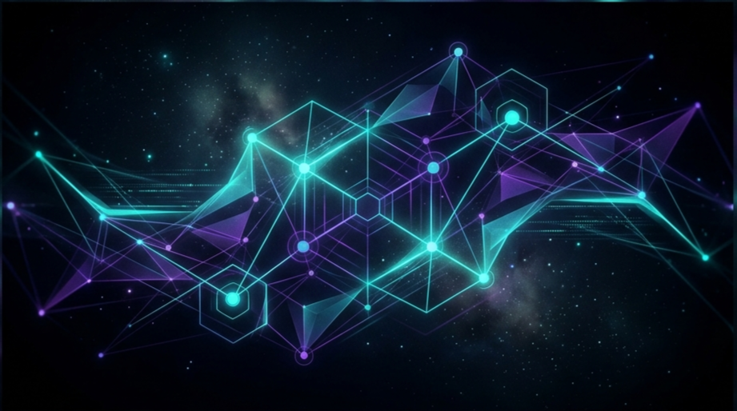
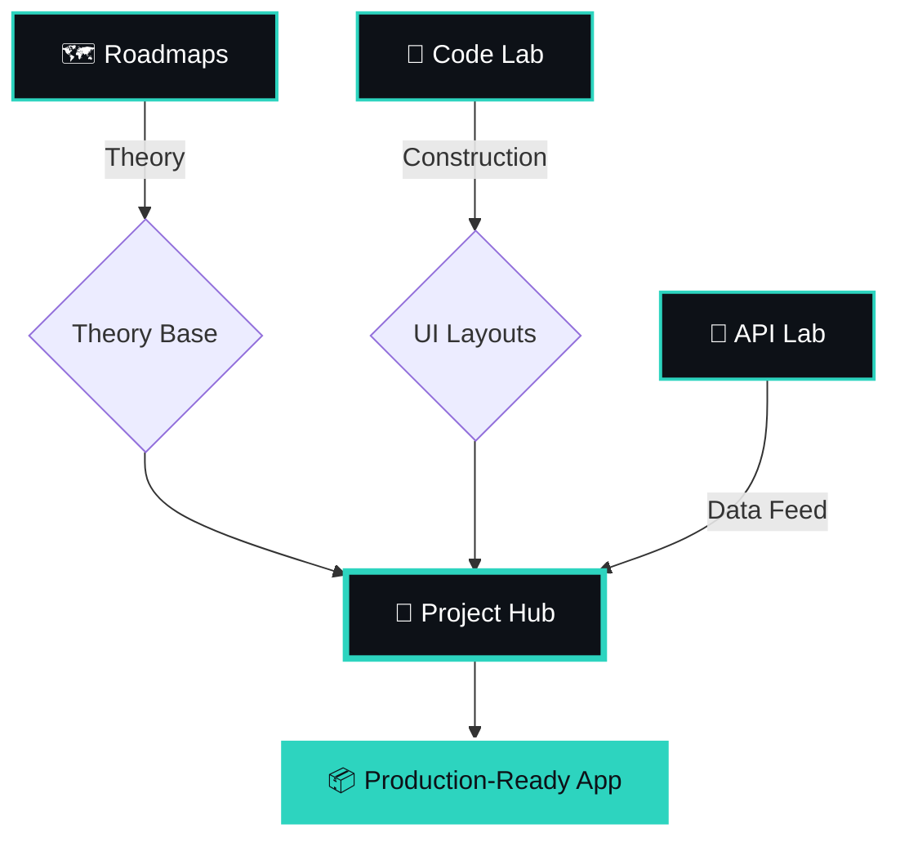
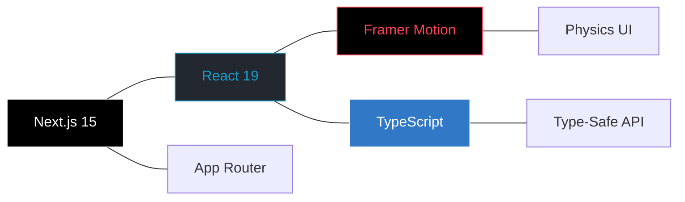

<div align="center">



<br />

**Navigate the Noise. Master the Code.**  
*A high-fidelity, unified ecosystem for the modern developer.*

<br />

[](https://nextjs.org/)
[](https://www.typescriptlang.org/)
[](https://www.framer.com/motion/)
[](https://www.gnu.org/licenses/gpl-3.0)
[](https://creativecommons.org/licenses/by-nc/4.0/)

<br />

---

### [ ⬡ ] Quick Navigation

**[ 🛰️ Overview ](#-ecosystem-architecture)** &nbsp; • &nbsp; **[ 🏗️ Architecture ](#-visual-logic-flow)** &nbsp; • &nbsp; **[ 💎 Why Halqa ](#-why-halqa)** &nbsp; • &nbsp; **[ ⚙️ Engineering ](#-engineering-deep-dives)** &nbsp; • &nbsp; **[ 📦 Setup ](#-installation-architecture)**

---

</div>

## ⬡ Ecosystem Architecture

Halqa dismantles the traditional, fragmented learning cycle. By unifying documentation, UI components, and live data sources into a single logical nexus, we provide a friction-free transition from rookie concepts to production-grade deployments.

### 🧩 The Four Pillars

| **🗺️ ROADMAPS** | **🧪 CODE LAB** |
| :--- | :--- |
| **The Theory Matrix**. Curated learning paths covering Frontend, Backend, and Mobile disciplines. Designed to build career-grade foundations mapping stage-by-stage engineering requirements. | **The Physics Engine**. A massive library of glassmorphic, fluid UI components. Built with Framer Motion to ensure high-end aesthetics meet zero-runtime overhead. |
| **🔌 API LAB** | **🚀 PROJECT HUB** |
| **The Data Vault**. A stable directory of public endpoints featuring local, regex-parsed schema visualizations. Test your apps on curated mock data without network instability. | **The Integration Nexus**. Real-world blueprints that link theoretical stages to specific code components and API feeds. The ultimate "Connect the Dots" application builder. |

---

## ⬡ Visual Logic Flow

The Halqa journey is a continuous cycle of discovery, experimentation, and construction.



---

## ⬡ Why Halqa?

Halqa is engineered for those who value speed, precision, and visual excellence. 



<br />

*   **⚡ Zero-Runtime Overhead**: Optimized Next.js 15 static generation ensures near-instantaneous load times (1793ms build speed).
*   **🛡️ Type-Safe Schemas**: Native TypeScript integration across all API mocks and component props ensures absolute build-time stability.
*   **💎 Fluid Micro-interactions**: Physics-based animations that react to the user, creating a professional "premium" software feel.
*   **🔭 Unified Discovery**: Stop switching tabs. Every resource, tool, and endpoint is accessible from a single, high-contrast dashboard.

---

## ⬡ Engineering Deep Dives

### I. Mathematical Micro-Interactions
In the **Code Lab**, we don't just use transitions; we use physics. Elements calculate vector distances between the cursor and the DOM center to drive dynamic scaling and levitation effects. Our **Isolated Play/Pause state logic** ensures that complex layout mutations never conflict with viewport resizing.

### II. Regex-Parsed Data Visualization
The **API Lab** implements a custom syntax-highlighting engine. By recursively parsing stringified JSON objects through specific regular expression matrices, we inject scoped CSS styling layers into the rendering tree, providing native code-editor fidelity without the overhead of external libraries.

### III. Tri-Node Blueprint Mapping
The **Project Hub** acts as the architect. It effectively "mounts" a development environment by fetching metadata from three separate Halqa silos and presenting them as a cohesive 3-step checklist for building specialized applications like AI-powered chat systems or real-time crypto dashboards.

---

## ⬡ Technical Specifications

| Layer | Implementation | Purpose |
| :--- | :--- | :--- |
| **Core** | Next.js 15 (App Router) | High-performance topological routing and static payload delivery. |
| **Motions** | Framer Motion & GSAP | Physics-driven layout transitions and spatial animations. |
| **Styling** | Vanilla CSS & Tailwind | High-contrast, minimalist aesthetics with scoped modularity. |
| **Type Logic** | TypeScript (Strict) | Cross-module safety for API interfaces and component definitions. |

---

## ⬡ Installation Architecture

Bootstrap your local development environment with these precise commands.

#### Step 01: Core Inception
```bash
# Clone the Halqa repository architecture
git clone https://github.com/Shuvo-code-dev/Halqa.git
```

#### Step 02: Environment Sync
```bash
# Enter the application root directory
cd Halqa/web
```

#### Step 03: Dependency Resolution
```bash
# Install the Node product ecosystem
npm install
```

#### Step 04: Local Activation
```bash
# Initiate the Turbopack development server
npm run dev
```

---

## ⬡ Roadmap: The Evolution

- [x] **Phase 1: Inception** `[██████████] 100%` - Core Roadmaps and Architecture.
- [x] **Phase 2: UI Mastery** `[██████████] 100%` - Code Lab expansion.
- [x] **Phase 3: Data Integrity** `[██████████] 100%` - API Lab stable mock engine.
- [x] **Phase 4: Global Universe** `[██████████] 100%` - Mobile/Fullstack expansion.
- [x] **Phase 5: Synthesis** `[██████████] 100%` - Project Hub 'Connect the Dots'.
- [ ] **Phase 6: Intelligence** `[░░░░░░░░░░] 0%` - AI-Powered Global Search.
- [ ] **Phase 7: Ecosystem** `[░░░░░░░░░░] 0%` - Community Template Systems.

---

## ⬡ Contributing

We welcome the engineering elite. If you find a bug, have a component suggestion, or want to add an API source:

1.  **Fork** the repository.
2.  **Create** an engineering branch (`git checkout -b feat/YourFeature`).
3.  **Commit** with precision.
4.  **Push** and open a PR.

<br />

---

## ⬡ License

Halqa is a dual-licensed project designed to protect both our engineering labor and educational integrity.

- **Source Code**: Protected under the **[GPL-3.0 License](https://www.gnu.org/licenses/gpl-3.0)**. You are free to copy, modify, and distribute the code, provided all derivative works remain open-source under the same terms.
- **Content & Roadmaps**: Protected under **[CC BY-NC 4.0](https://creativecommons.org/licenses/by-nc/4.0/)**. This covers all curriculum, roadmap stages, and educational logic. This content is for non-commercial use only.

<br />

> **© Shuvo-Code-Dev 2026.** Build with ❤️ by **Halqa Community**. Powerd by **[Oi Applications](https://play.google.com/store/apps/dev?id=5209526810797458542)**.
