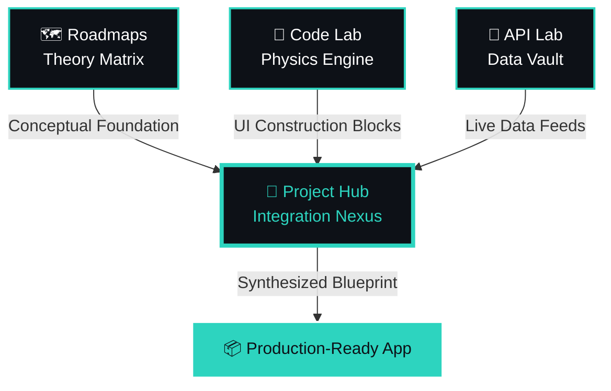
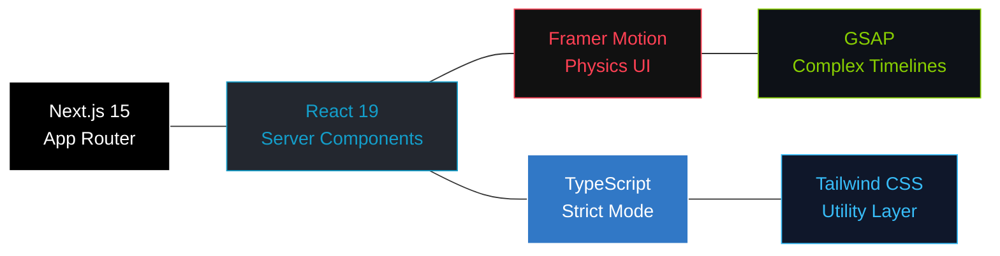

<div align="center">

<br />

### `[ ⬡ Navigate the Noise. Master the Code. ]`

> A high-fidelity, unified ecosystem for the modern developer —  
> where theory, components, and live data converge into one nexus.

<br />

<table>
<tr>
  <td align="center">
    <a href="https://nextjs.org/">
      
    </a>
  </td>
  <td align="center">
    <a href="https://www.typescriptlang.org/">
      
    </a>
  </td>
  <td align="center">
    <a href="https://www.framer.com/motion/">
      
    </a>
  </td>
</tr>
<tr>
  <td align="center">
    <a href="https://www.gnu.org/licenses/gpl-3.0">
      
    </a>
  </td>
  <td align="center">
    <a href="https://creativecommons.org/licenses/by-nc/4.0/">
      
    </a>
  </td>
  <td align="center">
    <a href="https://github.com/sponsors/Shuvo-code-dev">
      
    </a>
  </td>
</tr>
</table>

<br />

---

### Quick Navigation

[🛰️ Overview](#-ecosystem-overview) &nbsp;·&nbsp; [🏗️ Architecture](#-system-architecture) &nbsp;·&nbsp; [💎 Why Bulz](#-why-bulz) &nbsp;·&nbsp; [⚙️ Engineering](#-engineering-deep-dives) &nbsp;·&nbsp; [📦 Setup](#-installation) &nbsp;·&nbsp; [🗺️ Roadmap](#-roadmap)

---

</div>

<br />

## ⬡ Ecosystem Overview

Most developers waste hours jumping between disconnected tools — documentation tabs, UI snippet sites, API testers, and tutorial platforms. **Bulz ends that fragmentation.**

It is a **unified developer platform** built on four interconnected pillars: structured learning paths, a physics-driven component library, a live API sandbox, and a project builder that ties everything together. Whether you are starting your first project or deploying production-grade systems, Bulz provides a single, coherent workspace.

<br />

<div align="center">

| Pillar | Name            | Description                                                                                                                       |
| :----: | :-------------- | :-------------------------------------------------------------------------------------------------------------------------------- |
|   🗺️   | **Roadmaps**    | Curated, career-grade learning paths for Frontend, Backend, and Mobile — built stage by stage, like leveling up a skill tree.     |
|   🧪   | **Code Lab**    | A massive library of glassmorphic, physics-animated UI components. Built with Framer Motion for a premium, zero-compromise feel.  |
|   🔌   | **API Lab**     | A stable sandbox of public endpoints with inline, regex-parsed schema visualizations. No flaky third-party calls, no instability. |
|   🚀   | **Project Hub** | The synthesis layer. Mounts real-world blueprints that link roadmap stages → UI components → API data into one living project.    |

</div>

<br />

---

## ⬡ System Architecture

The Bulz journey is a **continuous feedback loop** — theory feeds construction, construction feeds data integration, and integration produces deployable applications.



<br />

> **The four pillars are not independent features.** They are nodes in a deliberate architecture — designed so that knowledge flows upward from theory into deployable, real-world software.

<br />

---

## ⬡ Why Bulz?

<div align="center">

```
The problem isn't a lack of resources.
It's that resources are everywhere — and connected to nothing.
```

</div>

<br />

Bulz was built on a single conviction: **learning tools should connect, not fragment.** Here is what that looks like in practice:

<br />

```
⚡  Zero-Runtime Overhead
    Next.js 15 static generation. Near-instant loads.
    Measured build speed: 1793ms. No compromises.

🛡️  Type-Safe Across Every Layer
    Strict TypeScript across all API mocks, component props,
    and data interfaces. Zero runtime type surprises.

💎  Physics-Driven Micro-interactions
    Components that respond to the user — not just react to clicks.
    Vector-calculated hover physics. Fluid layout transitions.

🔭  Unified Discovery
    One dashboard. Every tool, roadmap, component, and endpoint.
    Stop context-switching. Start building.
```

<br />

### Technology Constellation



<br />

---

## ⬡ Engineering Deep Dives

### I. · Mathematical Micro-Interactions

The **Code Lab** treats animation as physics, not timers. Each interactive component calculates the **vector distance** between the cursor and the element's DOM center in real time — using that delta to drive dynamic scaling, levitation depth, and directional shadow casting.

An **Isolated Play/Pause state machine** ensures that complex layout mutations (grid reflow, panel expansion, tab transitions) never race against viewport resize events. Every state transition is queued and resolved sequentially.

```
cursor (x, y) → Δ vector to DOM center → scale factor + shadow depth + levitation offset
```

<br />

### II. · Regex-Parsed Data Visualization

The **API Lab** contains a custom, zero-dependency syntax-highlighting engine. Rather than shipping a full library like Prism or Highlight.js, Bulz implements a **recursive JSON traversal system** that:

1. Stringifies the raw API response object
2. Passes each token through a targeted regex matrix
3. Injects scoped CSS class tokens into the render tree
4. Produces native code-editor fidelity at near-zero overhead cost

The result: a visual schema inspector that loads instantly and requires no external runtime.

<br />

### III. · Tri-Node Blueprint Mapping

The **Project Hub** is the architect's layer. When you open a project blueprint, it simultaneously fetches metadata from **three independent Bulz data nodes**:

| Node          | Source            | Purpose                                 |
| ------------- | ----------------- | --------------------------------------- |
| Theoretical   | Roadmaps API      | Which knowledge stages are prerequisite |
| Compositional | Code Lab registry | Which UI components to assemble         |
| Data          | API Lab directory | Which endpoints to wire in              |

These three streams merge into a **3-step checklist** — a living scaffold for building production systems like AI-powered chat apps or real-time crypto dashboards.

<br />

---

## ⬡ Technical Specifications

<div align="center">

| Layer              | Implementation          | Purpose                                                           |
| :----------------- | :---------------------- | :---------------------------------------------------------------- |
| **Core Framework** | Next.js 15 (App Router) | Topological routing, static payload delivery, RSC support         |
| **UI Runtime**     | React 19                | Server Components, concurrent rendering, streaming SSR            |
| **Motion Engine**  | Framer Motion + GSAP    | Physics-driven layout transitions and complex timeline animations |
| **Styling System** | Vanilla CSS + Tailwind  | High-contrast minimalist aesthetics with scoped module isolation  |
| **Type System**    | TypeScript (Strict)     | Cross-module safety for API interfaces and component definitions  |
| **Build Tooling**  | Turbopack               | Incremental bundling, sub-second HMR, optimized dev cycles        |

</div>

<br />

---

## ⬡ Installation

Get Bulz running locally in four precise steps.

<br />

**① Clone the repository**

```bash
git clone https://github.com/Shuvo-code-dev/Bulz.git
```

**② Navigate to the web application**

```bash
cd Bulz/web
```

**③ Install dependencies**

```bash
npm install
```

**④ Start the development server**

```bash
npm run dev
# Powered by Turbopack — expect <500ms HMR
```

<br />

> Open [http://localhost:3000](http://localhost:3000) to enter the Bulz ecosystem.

<br />

---

## ⬡ Roadmap

```
Phase 1 · Inception          [██████████] 100% — Core Roadmaps and Architecture
Phase 2 · UI Mastery         [██████████] 100% — Code Lab component expansion
Phase 3 · Data Integrity     [██████████] 100% — API Lab stable mock engine
Phase 4 · Global Universe    [██████████] 100% — Mobile and Fullstack expansion
Phase 5 · Synthesis          [██████████] 100% — Project Hub "Connect the Dots"
──────────────────────────────────────────────────────────────────────────────
Phase 6 · Intelligence       [░░░░░░░░░░]   0% — AI-Powered Global Search
Phase 7 · Ecosystem          [░░░░░░░░░░]   0% — Community Template Systems
```

<br />

Phases 6 and 7 are where Bulz becomes **community-driven**. If you want to accelerate these — contribute, sponsor, or open a discussion.

<br />

---

## ⬡ Contributing

We welcome engineers who care about craft. Here is how to contribute the right way:

```bash
# 1. Fork the repository on GitHub

# 2. Create a scoped feature branch
git checkout -b feat/your-feature-name

# 3. Commit with intent — describe the why, not just the what
git commit -m "feat: add physics hover to CodeLab card grid"

# 4. Push and open a Pull Request
git push origin feat/your-feature-name
```

We'd love your help! Check the [open issues](https://github.com/Shuvo-code-dev/Bulz/issues) or submit ideas via the [feature request template](https://github.com/Shuvo-code-dev/Bulz/issues/new?template=2-feature-request.yml).

Please read the [contribution guide](https://github.com/Shuvo-code-dev/Bulz/CONTRIBUTING.md) first — thanks for making Bulz better!

## 🙌 Contributors

<a href="https://github.com/Shuvo-code-dev/Bulz/graphs/contributors">
  
</a>

<br />

**Before opening a PR:**

- [ ] Ensure TypeScript strict mode passes with zero errors
- [ ] Test responsive behavior at 375px, 768px, and 1440px
- [ ] Components should match Bulz's visual language — high-contrast, physics-aware
- [ ] Include a brief description of _what problem your change solves_

<br />

---

## ⬡ License

Bulz uses a **dual-license model** to protect both engineering labor and educational integrity.

<br />

<div align="center">

| Asset Type             | License                                                         | Terms                                                                                                 |
| :--------------------- | :-------------------------------------------------------------- | :---------------------------------------------------------------------------------------------------- |
| **Source Code**        | [GPL-3.0](https://www.gnu.org/licenses/gpl-3.0)                 | Free to copy, modify, and distribute — all derivatives must remain open-source under the same terms.  |
| **Content & Roadmaps** | [CC BY-NC 4.0](https://creativecommons.org/licenses/by-nc/4.0/) | All curriculum, roadmap stages, and educational logic. Non-commercial use only. Attribution required. |

</div>

<br />

> TL;DR — **Use the code freely. Don't monetize the curriculum.**

<br />

---

<div align="center">

_Built with precision. Designed for engineers who care._

<br />

[](https://github.com/Shuvo-code-dev/Bulz)
&nbsp;&nbsp;
[](https://github.com/Shuvo-code-dev/Bulz/fork)
&nbsp;&nbsp;
[](https://github.com/sponsors/Shuvo-code-dev)

<br />

_If Bulz helped you build something — give it a ⭐ and tell a fellow developer._

<br />

---

🇵🇸 **We stand with Palestine. Free Palestine. Support Palestine.**

</div>
